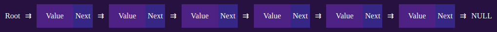

# Listas

Nas listas podemos, **Adicionar**, **Remover**, **Percorrer** e **Realizar uma busca**.

A maior diferença entre os arrays e a lista é a sua flexibilidade e a diferença em relação a outras estruturas é que a lista não segue regras especificas em seus métodos.

A lista é a forma base de todas as outras estruturas, logicamente usamos variáveis de listas para formar-las.

## Struct

Veja antes de começarmos a fazer listas devemos ver mais um operador de C, usaremos a palavra reservada *struct*. Ela permite agrupar dados de tipos diferentes, como se fosse uma classe, mas não é.

Sintaxe da declaração:
~~~
typedef struct {
    int number;
    char *str;
} NameStruct;
~~~

Sintaxe da implementação:
~~~
NameStruct s;
s.number = 0;
s.str = "string";
~~~

## Lista encadeada
> /Exemplos/list.c
###  Struct usada

Vamos criar uma struct simples, chamada de nó e com uma variável chamada value.
~~~
typedef struct {
    int value;
    Node *next;
} Node;
~~~
Veja que temos um ponteiro para a struct **"Node *next;"**, ele vai servir para apontar para o proximo nó da lista.

### Declarar
> Complexidade = O(1)
~~~
Node *root = NULL;
~~~
### Adicionar no final
> Complexidade = O(n)
~~~
Node *nodeAdd(Node *root, int value)
{
    Node *newNode = (Node *)malloc(sizeof(Node));
    newNode->value = value;
    newNode->next = NULL;
    if (root == NULL)
        root = newNode;
    else
    {
        Node *ptr = root;
        while (ptr->next != NULL)
            ptr = ptr->next;
        ptr->next = newNode;
    }
    if (root == NULL)
        printf("root\n");
    return root;
}
~~~
### Percorrer
> Complexidade = O(n)
~~~
void nodeTravel(Node *root)
{
    Node *ptr = root;
    int index = 0;
    while (ptr != NULL)
    {
        printf("%d: [value: %d | next: %x]\n", index, ptr->value, ptr->next);
        ptr = ptr->next;
        index++;
    }
}
~~~
### Buscar
> Complexidade = O(n)
~~~
Node *nodeContains(Node *root, int value)
{
    Node *ptr = root;
    while (ptr != NULL)
    {
        if (ptr->value == value)
            break;
        ptr = ptr->next;
    }
    return ptr;
}
~~~
### Atualizar
> Complexidade = O(n)
~~~
Node *nodeUpdate(Node *root, int oldValue, int newValue)
{
    Node *ptr = root;
    while (ptr != NULL)
    {
        if (ptr->value == oldValue)
        {
            ptr->value = newValue;
            break;
        }
        ptr = ptr->next;
    }
    return root;
}
~~~
### Remover
> Complexidade = O(n)
~~~
Node *nodeRemove(Node *root, int value)
{
    Node *ptr = root;
    Node *target = ptr->next;
    while (ptr != NULL)
    {
        if (target != NULL)
        {
            if (target->value == value)
            {
                ptr->next = target->next;
                free(target);
                break;
            }
        }
        ptr = ptr->next;
        target = ptr->next;
    }
    return root;
}
~~~

### Conclusão

Estas são as bases para as outras estruturas, veja que as operações acima estão todas em O(n), porque existe a necessidade de percorrer toda a lista para cada operação.

As outras estrutura variam da fila de alguma forma, seja mudando as regras de algumas operações, seja para resolver o problema da complexidade.